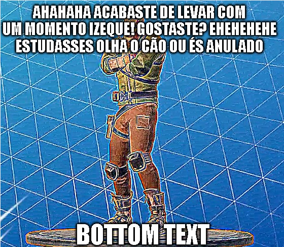

# Licenciatura de Engenharia Informática 2019-2022

Todo o material que juntei durante a minha licenciatura de engenharia informática no ISEC.

Cada cadeira tem um ramo (branch).

A licença de uso é a GNUGPLv3 e pode ser encontrada [aqui](LICENSE).

**TL:DR: Esta licença permite ao povo fazer basicamente tudo o que desejar exceto distribuir versões de código fechado.**

